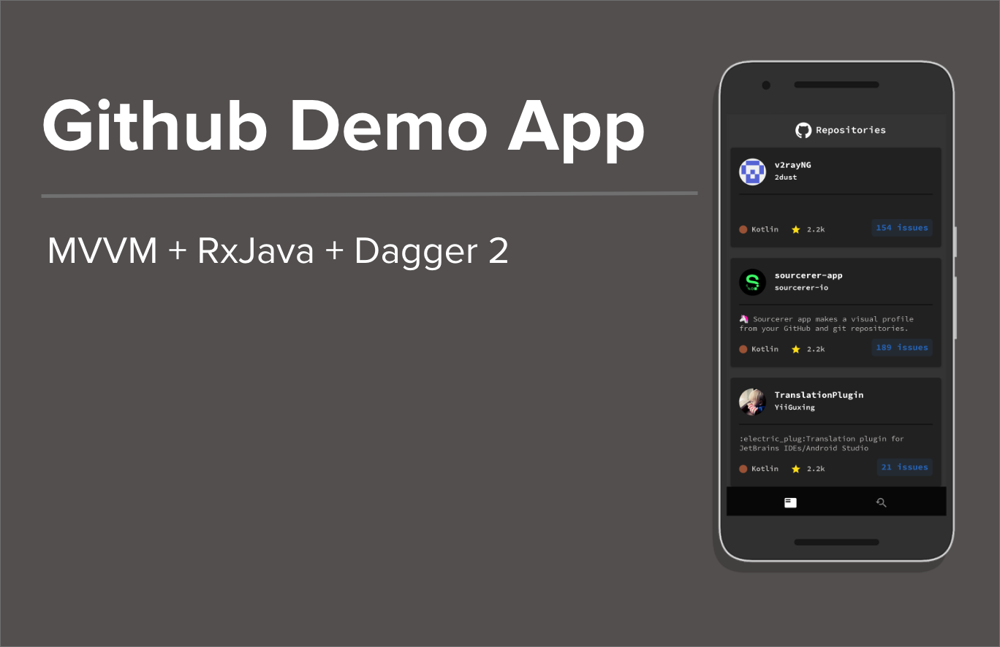

Github demo app's design is inspired from illustrations of [Aakash Raj Dahal](https://dribbble.com/AkashRajDahal)
 

# GITHUB DEMO APP

The following is an android demonstration application used to show the usage of MVVM architecture along with RxJava.  
The Application uses the Gihub Open Api v3 to request the list of public repositories with the language reference <code>Kotlin</code> in them.

 

The Applications makes use of 

 

- <code>ViewModel</code> which acts as a controller to the activity
- <code>Repository</code> which acts as a network data provider (Since the concept of local cache is not valid here)
- <code>Dagger2</code> which allows dependecy injections across the application
- <code>Retrofit</code> which the rest api client used in the to make network calls
- <code>Picasso</code> for image loading
- <code>RxJava</code> for asynchronous programming
